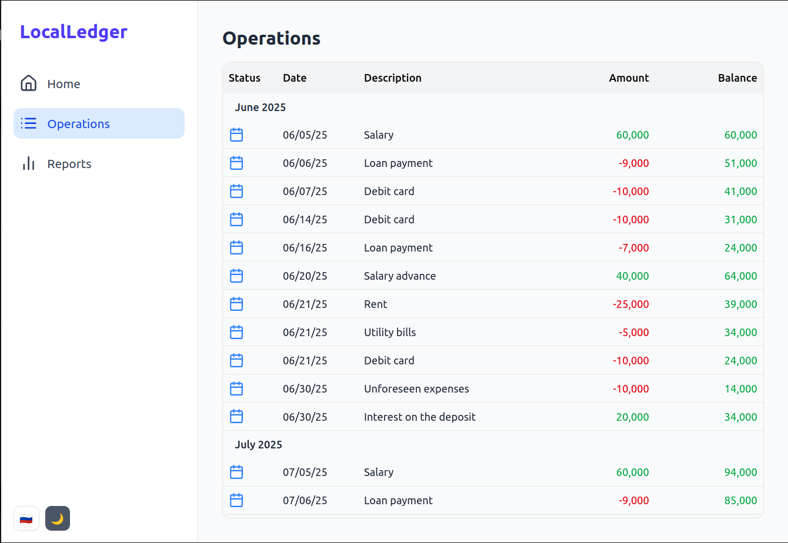

# Local Ledger

Local Ledger is a browser-based application for simple financial accounting and forecasting, allowing you to export and import its state in JSON format.  

## Run

```bash
docker compose -f docker/docker-compose.yml up --build -d
```

 Launch http://localhost:3000

## Screens

### Laptop


### Mobile


### Mobile dark
